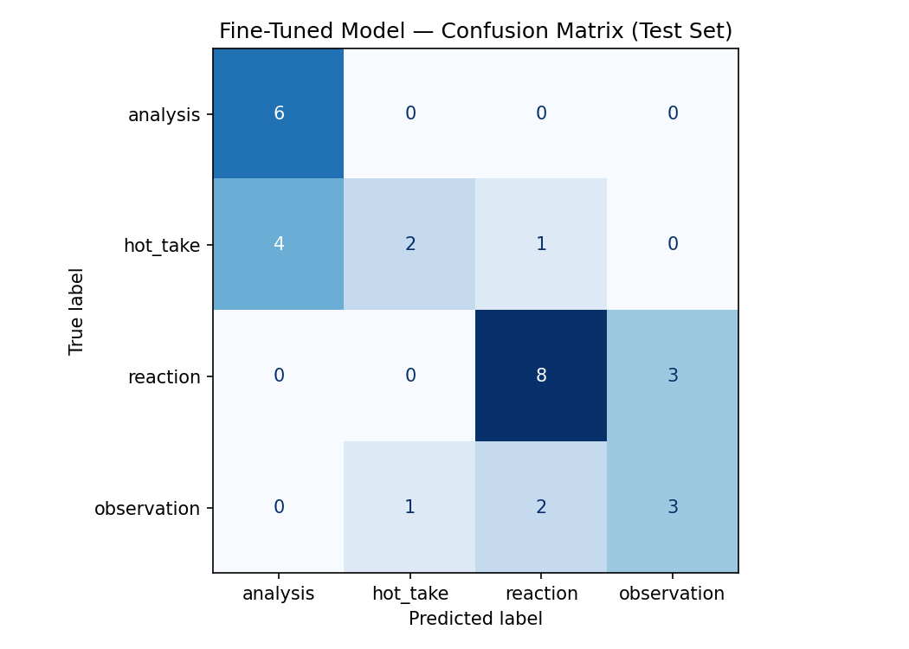

# TakeMeter: Classifying Football Discourse on r/soccer

## Project Overview

TakeMeter is a text-classification project that evaluates the type of discourse used in English-language football comments from **r/soccer**. The classifier assigns each comment one of four labels: `analysis`, `hot_take`, `reaction`, or `observation`.

The goal was not to determine whether a football opinion is objectively correct. Instead, the project measures how the opinion is communicated: through evidence-based reasoning, an unsupported assertion, an emotional response, or a factual observation.

---

## Community Choice

I selected **r/soccer**, an active public football community where users discuss matches, players, managers, tactics, statistics, transfers, and football history.

The subreddit is a strong fit for this classification task because its comments vary significantly in purpose and depth. Some users provide detailed tactical reasoning, while others make unsupported predictions, express immediate match-day emotions, or report facts and patterns without explanation. The large volume of public text-based discussion also made it practical to collect more than 200 examples.

Seattle's role as a host city for the 2026 FIFA World Cup made football discussion especially timely and personally relevant to me.

---

## Label Taxonomy

### `analysis`

A structured football argument supported by specific evidence, such as statistics, tactical reasoning, concrete examples, or historical comparisons.

**Examples:**

> When he plays as a six, he focuses on retaining possession and passing into space so another midfielder can progress the ball.

> Among 76 players at this World Cup who attempted at least 100 passes, he had the fewest inaccurate passes, showing how reliable he was in possession.

### `hot_take`

A bold, confident football opinion stated without meaningful supporting evidence. The comment asserts a conclusion rather than developing an argument.

**Examples:**

> The stars are not going to determine this World Cup.

> If Celje played against Frankfurt, they could keep up.

### `reaction`

An immediate emotional or humorous response to a specific football event or statement. The main purpose is expressing a feeling rather than making an argument.

**Examples:**

> My word, we are awful. I genuinely find us painful to watch.

> I'm still annoyed that we did not get to see Brazil play Argentina in the 2022 semifinal.

### `observation`

A neutral or lightly evaluative comment that reports a fact, identifies a pattern, or makes a comparison without explaining why it happened.

**Examples:**

> Sweden's matches alone have produced ten goals already.

> He is one of the youngest regular starting center-backs at the tournament.

---

## Data Collection

I collected public comments from several types of r/soccer threads:

* post-match discussions
* player and manager quote threads
* tactical discussions
* statistics posts
* historical football discussions
* selected goal and highlight threads

I excluded bot messages, moderator notices, deleted comments, duplicates, spam, comments containing only links, and comments that could not be interpreted without missing context.

The final dataset contains **200 labeled comments** in one CSV file with the following columns: `text`, `label`, and `notes`. The optional `notes` field was used for genuinely difficult annotation decisions.

### Label Distribution

| Label         | Count | Percentage |
| ------------- | ----: | ---------: |
| `analysis`    |    41 |      20.5% |
| `hot_take`    |    47 |      23.5% |
| `reaction`    |    72 |      36.0% |
| `observation` |    40 |      20.0% |
| **Total**     | **200** | **100%** |

Although `reaction` was the largest class, no label represented more than 70% of the dataset.

---

## Labeling Process

Each comment was assigned exactly one label according to its primary communicative purpose using the following priority order:

1. A comment explaining **why or how** something happened using specific reasoning or evidence was labeled `analysis`.
2. A strong unsupported judgment or prediction was labeled `hot_take`.
3. A comment mainly expressing emotion, humor, celebration, disappointment, or surprise was labeled `reaction`.
4. A comment mainly reporting a fact, pattern, event, or comparison was labeled `observation`.

AI assistance was used to suggest preliminary labels, but I reviewed every example and revised labels and notes before using the dataset.

---

## Difficult Annotation Decisions

### Case 1: `analysis` vs. `hot_take`

> De Jong actually plays a lot of progressive passes though. If someone actually thinks he's not a good player, you should probably disregard their footballing input.

This could be a `hot_take` because the conclusion is dismissive, or `analysis` because progressive passing is cited as evidence. I labeled it `analysis` because the passing claim is a concrete, verifiable football observation that supports the evaluation.

### Case 2: `observation` vs. `reaction`

> What's his passing like now? From my memory he was always pretty good at finding the right person but I haven't watched him in years. I have hope Mainoo would develop that side of his game a bit more.

This could be `reaction` because it expresses personal hope, or `observation` because it describes a remembered passing trait and compares it with another player's development. I labeled it `observation` because the descriptive comparison is the main purpose.

### Case 3: `observation` vs. `reaction`

> Easy to make fun of because of his mistakes but he's about the same age as Lamine. Pretty impressive.

This could be `reaction` because it expresses admiration, or `observation` because the age comparison is the main point. I labeled it `observation` because the factual comparison drives the comment, while the admiration is secondary.

---

## Model and Fine-Tuning Approach

I fine-tuned **`distilbert-base-uncased`** using the Hugging Face Transformers library in Google Colab with a T4 GPU.

### Training Setup

| Parameter | Value |
| --------- | ----- |
| Base model | `distilbert-base-uncased` |
| Number of labels | 4 |
| Epochs | 10 |
| Learning rate | `5e-5` |
| Batch size | 8 |
| Weight decay | 0.01 |
| Warmup steps | 10 |
| Training split | 70% (140 examples) |
| Validation split | 15% (30 examples) |
| Test split | 15% (30 examples) |

The default learning rate of `2e-5` with 3 epochs produced near-random validation accuracy. I increased the learning rate to `5e-5`, reduced the batch size to 8 for more frequent gradient updates, and increased epochs to 10. Using `load_best_model_at_end=True` meant the trainer automatically selected the best validation checkpoint rather than the final epoch.

---

## Zero-Shot Baseline

The baseline used Groq's `llama-3.3-70b-versatile` without task-specific training. All 30 test responses were parseable.

The system prompt contained the r/soccer classification task, definitions of all four labels, one example per label, decision rules for ambiguous comments, and an instruction to return only the exact label name.

---

# Evaluation Report

## Overall Comparison

| Model                   | Accuracy | Improvement |
| ----------------------- | -------: | ----------: |
| Zero-shot Groq baseline |   43.33% | —           |
| Fine-tuned DistilBERT   |   63.33% | +20 points  |

The fine-tuned model substantially outperformed the zero-shot baseline, although it did not reach the original project success target of 70% accuracy.

---

## Baseline Per-Class Metrics

| Label             | Precision | Recall |   F1 | Support |
| ----------------- | --------: | -----: | ---: | ------: |
| `analysis`        |      0.50 |   0.33 | 0.40 |       6 |
| `hot_take`        |      0.50 |   0.14 | 0.22 |       7 |
| `reaction`        |      0.43 |   0.82 | 0.56 |      11 |
| `observation`     |      0.33 |   0.17 | 0.22 |       6 |
| **Macro average** |      0.44 |   0.37 | 0.35 |      30 |

The baseline strongly favored `reaction`, with recall of 0.82 but precision of only 0.43, showing it incorrectly assigned many non-reaction comments to that category.

---

## Fine-Tuned Model Per-Class Metrics

| Label             | Precision | Recall |   F1 | Support |
| ----------------- | --------: | -----: | ---: | ------: |
| `analysis`        |      0.60 |   1.00 | 0.75 |       6 |
| `hot_take`        |      0.67 |   0.29 | 0.40 |       7 |
| `reaction`        |      0.73 |   0.73 | 0.73 |      11 |
| `observation`     |      0.50 |   0.50 | 0.50 |       6 |
| **Macro average** |      0.62 |   0.63 | 0.59 |      30 |

The fine-tuned model learned `analysis` and `reaction` most successfully. It identified all six true analysis examples but over-predicted that label, pulling in several hot takes.

---

## Fine-Tuned Confusion Matrix

Rows represent the true label. Columns represent the predicted label. Diagonal cells are correct predictions.

| True ↓ / Predicted → | `analysis` | `hot_take` | `reaction` | `observation` |
| --------------------- | ---------: | ---------: | ---------: | ------------: |
| `analysis`            |      **6** |          0 |          0 |             0 |
| `hot_take`            |          4 |      **2** |          1 |             0 |
| `reaction`            |          0 |          0 |      **8** |             3 |
| `observation`         |          0 |          1 |          2 |         **3** |

---

## Error Pattern Analysis

The fine-tuned model made 11 incorrect predictions out of 30 test examples.

The strongest directional error was `hot_take` being predicted as `analysis`. Four of the seven true hot takes were classified as analysis. These comments often contained football terminology, comparisons, or brief explanations, which made them look analytical on the surface. However, under my labeling rules, analysis requires meaningful evidence or developed reasoning. The model appears to have learned that explanation-like wording and football-specific vocabulary signal analysis, even when the claim remains broad or unsupported.

A second recurring problem was confusion between `reaction` and `observation`. Three reactions were predicted as observations, while two observations were predicted as reactions. Many of these comments were short and contained both a factual reference and an emotional, sarcastic, or evaluative tone. The model had difficulty determining which element represented the comment's primary purpose.

Some mistakes may also reflect genuine annotation ambiguity. Comments such as "Why? It's still games played" and "You would have thought that the goalkeeper should have expected that" could reasonably be interpreted differently without the surrounding conversation. This suggests that including more conversational context, excluding highly context-dependent replies, or tightening the annotation rules could improve future versions of the dataset.

---

## Specific Incorrect Predictions

### Error 1: Unsupported criticism mistaken for analysis

**Comment:**

> These stats don't mean anything. More interesting would be line breaking, forward, difficult passes.

**True label:** `hot_take` | **Predicted label:** `analysis` | **Confidence:** 0.44

This comment uses football-specific language and proposes alternative measures, so it resembles analysis. However, it dismisses the original statistics without supplying evidence, examples, or a developed explanation for why they are meaningless. Under my taxonomy, this remains a `hot_take`.

The model likely relied on words such as "stats," "line breaking," and "difficult passes" as signals of analytical discourse. This reveals that it learned topical vocabulary more readily than the deeper distinction between supported and unsupported reasoning.

More training examples containing tactical terminology but weak support could help the model learn that vocabulary alone does not make a comment analytical.

### Error 2: Strong managerial judgment mistaken for analysis

**Comment:**

> I'm Scottish, I fucking hate that Steve Clarke is our manager. Decent bloke though. Pragmatic beyond to a fault, absolute dinosaur football and management. A real microcosm of everything that's wrong with Scottish football.

**True label:** `hot_take` | **Predicted label:** `analysis` | **Confidence:** 0.66

The comment gives several reasons for disliking the manager, including excessive pragmatism and outdated football. This creates the appearance of structured reasoning. However, the claims are broad, emotionally charged, and unsupported by specific matches, tactical examples, or evidence.

The prediction suggests that the model associated longer comments and explanation-like structure with `analysis`. The human label instead focused on whether the explanation was sufficiently supported.

This error could be reduced by adding more long-form hot takes to the training set. Otherwise, the model may learn the shortcut that long comments are analysis and short comments are reactions.

### Error 3: Sarcastic reaction mistaken for observation

**Comment:**

> Especially after he saved one from English star striker Chip Downthemiddle in the round before.

**True label:** `reaction` | **Predicted label:** `observation` | **Confidence:** 0.63

The sentence refers to a previous penalty save, which gives it the surface form of a factual observation. However, the nickname "Chip Downthemiddle" is sarcastic and humorous, making the comment primarily a reaction.

The model likely focused on the reference to a past event and missed the sarcastic tone. This is a common limitation in short text classification because sarcasm often depends on cultural knowledge, nicknames, or conversational context.

### Error 4: Emotional approval mistaken for observation

**Comment:**

> Great to see the young players inspired by Chris Richards.

**True label:** `reaction` | **Predicted label:** `observation` | **Confidence:** 0.39

The comment refers to young players being inspired by someone, which can sound descriptive. However, "Great to see" expresses approval and makes the comment primarily an emotional reaction.

The low confidence indicates that the model also found the example ambiguous. The error likely occurred because the factual clause occupied most of the sentence, while the emotional signal was contained in only a few words.

### Error 5: Factual comparison mistaken for reaction

**Comment:**

> First one who comes to mind at that club/country level (Barcelona / Spain) is Varane and that was ... 10 years ago, crazy.

**True label:** `observation` | **Predicted label:** `reaction` | **Confidence:** 0.71

The main content is a historical comparison, so I labeled it `observation`. The final word "crazy" adds a mild emotional reaction, but it is secondary to the factual comparison. The model appears to have focused strongly on that single emotional word, showing that a small amount of expressive language can outweigh the rest of the sentence in the learned decision boundary.

---

## Sample Classifications

These are real predictions produced by the fine-tuned model on the test set, with actual softmax confidence scores.

| Comment | True label | Predicted label | Confidence | Correct? |
| ------- | ---------- | --------------- | ---------: | -------- |
| "I wanna see a player bring back the 70s goal celebration of running with arms in the air like this" | `reaction` | `reaction` | 0.488 | ✅ |
| "4 wins out of 14 games, worst point average by an Eintracht coach since 2016 btw 😭" | `observation` | `observation` | 0.633 | ✅ |
| "While he was in charge, I genuinely do believe Celje could have beaten us. So I guess he's right." | `hot_take` | `hot_take` | 0.443 | ✅ |
| "Not a big fan of him but he's worked wonders with that team but equally agree with him, catching him 30 seconds from the end of the game and asking him 100 questions is just pointless." | `analysis` | `analysis` | 0.859 | ✅ |
| "These stats don't mean anything. More interesting would be line breaking, forward, difficult passes." | `hot_take` | `analysis` | 0.438 | ❌ |

The fourth prediction is reasonable because the comment explains a specific cause-and-effect argument — that interviewing a manager immediately after a match produces useless responses — and supports it with a concrete scenario rather than simply asserting an opinion.

---

## What the Model Learned vs. What I Intended

I intended the model to distinguish comments according to their reasoning structure and primary communicative purpose. In particular, `analysis` was supposed to require meaningful evidence or explanation, while `hot_take` was supposed to represent confident assertions without adequate support.

The fine-tuned model captured some of these distinctions. It recognized all true analysis examples and performed well on reactions. However, it appears to have learned that football-specific terminology, longer wording, or the appearance of an explanation often signals analysis. This shortcut caused it to classify four unsupported hot takes as analysis.

The model also struggled when factual and emotional language occurred together. This shows that identifying a comment's primary purpose is more difficult than detecting keywords or sentiment. A larger dataset with more examples near the label boundaries would likely improve the learned decision boundary.

---

## Definition-of-Success Review

My original project targets were at least 70% overall accuracy, at least 0.65 macro F1, at least 0.55 F1 for every class, and better performance than the zero-shot baseline.

The model achieved 63.33% accuracy, 0.59 macro F1, and beat the baseline by 20 percentage points. It did not meet the full success threshold — `hot_take` F1 of 0.40 and `observation` F1 of 0.50 fell below the per-class minimum.

I would not deploy this model as an automatic moderation or ranking system. It could be used experimentally as a human-review aid, but its predictions — especially for `hot_take` and `observation` — should not be treated as definitive.

---

## Spec Reflection

The specification helped by requiring label definitions and decision rules before any data collection. Writing the boundary rules for `analysis` vs. `hot_take` before annotating 200 examples forced me to think through the hardest cases in advance rather than making inconsistent decisions during labeling.

The implementation diverged from the ideal target distribution because `reaction` remained the largest class at 36%. This reflects the natural distribution of comments in match-related football discussions. I accepted the imbalance because every class still represented at least 20% of the dataset and no class exceeded the project's 70% maximum.

---

## AI Usage

### 1. Label taxonomy and stress-testing

I asked Claude to help refine the definitions of `analysis`, `hot_take`, `reaction`, and `observation`, and to identify comments that could sit between multiple labels. The tool produced proposed definitions, examples, and decision rules. I revised the rules to require meaningful evidence for `analysis` and to use the comment's primary communicative purpose when emotional and factual elements appeared together.

### 2. Annotation assistance

I used AI assistance to suggest labels for collected Reddit comments and to produce an initial CSV. I reviewed the dataset, removed duplicate and contextless comments, corrected conflicting labels, and added notes to difficult examples. For example, duplicate versions of "anulo mufa" had originally received conflicting labels — I removed both entries rather than preserving inconsistent training data.

### 3. Failure analysis

I used Claude to review the confusion matrix and wrong predictions and identify recurring error patterns. The tool suggested that the model confused `hot_take` with `analysis` and mixed `reaction` with `observation`. I verified these claims against the confusion matrix and retained only patterns supported by multiple errors.

---

## Demo Video

[Watch the 3–5 minute demo](https://www.loom.com/share/e14acf4a74754ebc9eef8307bfe51845)

The demo includes:

* 3–5 comments classified by the fine-tuned model with predicted labels and confidence scores
* one correct prediction with an explanation of why it is reasonable
* one incorrect prediction with an explanation of what went wrong
* a walkthrough of the evaluation report